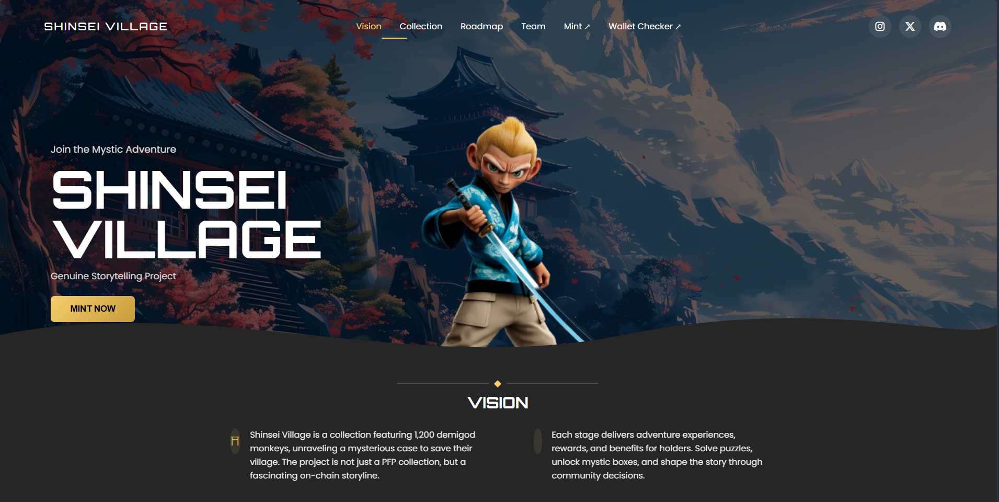

# 🎯 A3 - Assignment Three

This assignment focuses on creating UI designs using **CSS Flexbox** and **Position properties**.

---

## 🚀 Project Overview

In this assignment, I recreated **three UI designs** using:

* `display: flex`
* `position: relative`
* `position: absolute`
* Proper spacing and alignment techniques

I tried to match the designs as closely as possible to the original references.

---

## 🛠️ Technologies Used

* HTML5
* CSS3
* Flexbox
* Position (relative & absolute)

---

📸 Screenshots

Example:

---

## 🤖 AI Usage

For this assignment, I used **AI tools (like ChatGPT)** to:

* Understand complex layout structures
* Fix styling and alignment issues
* Get guidance when I was stuck

I still implemented and practiced the code myself to improve my understanding.

---

## 📚 What I Learned

* Better understanding of **Flexbox layout**
* How to use **positioning (relative & absolute)** properly
* Improving UI design accuracy
* Debugging layout and spacing issues
* Using AI as a **learning tool**, not just for direct answers

---

## 🧠 Conclusion

This assignment helped me improve my frontend skills and confidence in building real-world UI layouts using CSS.

---
